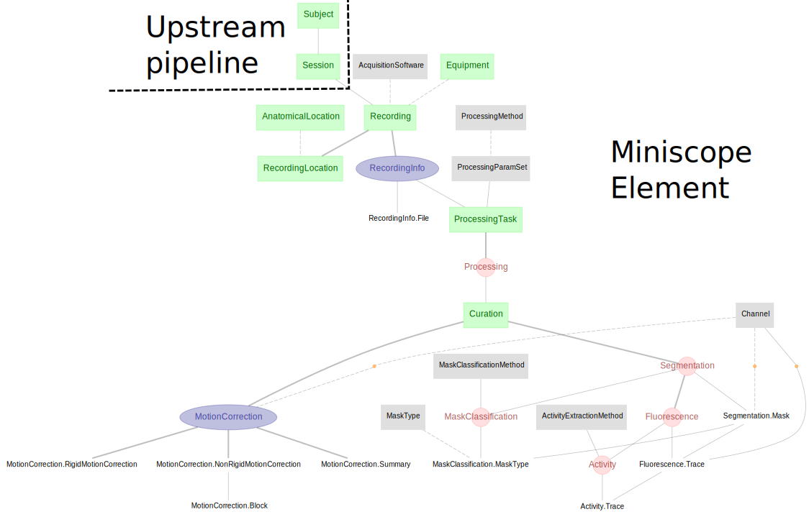

# DataJoint Workflow - Miniscope

Workflow for miniscope calcium imaging data acquired with miniature microscopes (e.g. 
[UCLA Miniscope](https://github.com/Aharoni-Lab/Miniscope-v4)) using the 
[Miniscope-DAQ](https://github.com/Aharoni-Lab/Miniscope-DAQ-QT-Software) acquisition 
software and processed with [CaImAn](https://github.com/flatironinstitute/CaImAn).

A complete miniscope workflow can be built using the DataJoint Elements:
+ [element-lab](https://github.com/datajoint/element-lab)
+ [element-animal](https://github.com/datajoint/element-animal)
+ [element-session](https://github.com/datajoint/element-session)
+ [element-miniscope](https://github.com/datajoint/element-miniscope)

This repository provides demonstrations for:
1. Set up a workflow using DataJoint Elements (see 
[workflow_miniscope/pipeline.py](workflow_miniscope/pipeline.py))
2. Ingestion of data/metadata based on a predefined file structure, file naming 
convention, and directory lookup methods (see 
[workflow_miniscope/ingest.py](workflow_miniscope/ingest.py))
3. Processing results.

See the [Element Miniscope documentation](https://elements.datajoint.org/description/miniscope/) for the background information and development timeline.

For more information on the DataJoint Elements project, please visit https://elements.datajoint.org.  This work is supported by the National Institutes of Health.

## Workflow architecture

+ The miniscope calcium imaging workflow presented here uses components from four 
DataJoint Elements ([element-lab](https://github.com/datajoint/element-lab),
 [element-animal](https://github.com/datajoint/element-animal), 
 [element-session](https://github.com/datajoint/element-session) and 
 [element-miniscope](https://github.com/datajoint/element-miniscope)) assembled 
 together to form a fully functional workflow.

## Installation instructions

+ The installation instructions can be found at the 
[DataJoint Elements documentation](https://elements.datajoint.org/usage/install/).

## Interacting with the DataJoint workflow

+ Please refer to the following workflow-specific 
 [Jupyter notebooks](/notebooks) for an in-depth explanation of how to run the 
 workflow ([03-process.ipynb](notebooks/03-process.ipynb)) and explore the data 
 ([05-explore.ipynb](notebooks/05-explore.ipynb)).

## Citation

+ If your work uses DataJoint and DataJoint Elements, please cite the respective Research Resource Identifiers (RRIDs) and manuscripts.

+ DataJoint for Python or MATLAB
    + Yatsenko D, Reimer J, Ecker AS, Walker EY, Sinz F, Berens P, Hoenselaar A, Cotton RJ, Siapas AS, Tolias AS. DataJoint: managing big scientific data using MATLAB or Python. bioRxiv. 2015 Jan 1:031658. doi: https://doi.org/10.1101/031658

    + DataJoint ([RRID:SCR_014543](https://scicrunch.org/resolver/SCR_014543)) - DataJoint for `<Select Python or MATLAB>` (version `<Enter version number>`)

+ DataJoint Elements
    + Yatsenko D, Nguyen T, Shen S, Gunalan K, Turner CA, Guzman R, Sasaki M, Sitonic D, Reimer J, Walker EY, Tolias AS. DataJoint Elements: Data Workflows for Neurophysiology. bioRxiv. 2021 Jan 1. doi: https://doi.org/10.1101/2021.03.30.437358

    + DataJoint Elements ([RRID:SCR_021894](https://scicrunch.org/resolver/SCR_021894)) - Element Miniscope (version `<Enter version number>`)