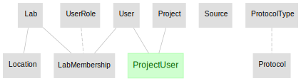
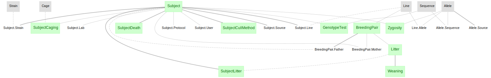

# Workflow for calcium imaging data acquired with Miniscope

+ A complete imaging workflow can be built using the DataJoint elements:
    + [element-lab](https://github.com/datajoint/element-lab)
    + [element-animal](https://github.com/datajoint/element-animal)
    + [element-session](https://github.com/datajoint/element-session)
    + [element-miniscope](https://github.com/datajoint/element-miniscope)

+ This repository provides demonstrations for:
    + Set up a workflow using different elements (see [workflow_miniscope/pipeline.py](workflow_miniscope/pipeline.py))
    + Ingestion of data/metadata based on:
        + predefined file/folder structure and naming convention
        + predefined directory lookup methods (see [workflow_miniscope/paths.py](workflow_miniscope/paths.py))
    + Ingestion of processed results (built-in routine from the imaging element)

+ This workflow provides support for miniscope calcium imaging data acquired with the `Miniscope-DAQ` systems.  And for data processed with `CaImAn`, or `Miniscope Analysis`.
    + Note the [`Miniscope Analysis`](https://github.com/etterguillaume/MiniscopeAnalysis) package is not currently maintained.

+ See [DataJoint Elements](https://github.com/datajoint/datajoint-elements) for descriptions of the other `elements` and `workflows` developed as part of this initiative.

## Workflow architecture

The Calcium imaging workflow presented here uses pipeline components from 4 DataJoint Elements, 
`element-lab`, `element-animal`, `element-session` and `element-miniscope`, assembled together to form a fully functional workflow. 

### elements-lab



### elements-animal



### elements-imaging


## Installation instructions

### Step 1 - Clone this repository

+ It is recommended to fork this repository and install a clone of your fork.

+ Launch a new terminal and change directory to where you want to clone the repository
    ```
    cd C:/Projects
    ```
+ Clone the repository
    ```
    git clone https://github.com/datajoint/workflow-miniscope
    ```
+ Change directory to `workflow-miniscope`
    ```
    cd workflow-miniscope
    ```

### Step 2 - Setup a virtual environment
+ It is highly recommended (though not strictly required) to create a virtual environment to run the pipeline.

+ If you are planning on running CaImAn from within this pipeline, you can install this pipeline within the `conda` environment created for the CaImAn installation.
    + [CaImAn installation instructions](https://caiman.readthedocs.io/en/master/Installation.html)

+ You can install with `virtualenv` or `conda`.  Below are the commands for `virtualenv`.

+ If `virtualenv` not yet installed, run `pip install --user virtualenv`

+ To create a new virtual environment named `venv`:
    ```
    virtualenv venv
    ```

+ To activated the virtual environment:
    + On Windows:
        ```
        .\venv\Scripts\activate
        ```

    + On Linux/macOS:
        ```
        source venv/bin/activate
        ```

### Step 3 - Install this repository

From the root of the cloned repository directory:
    ```
    pip install -e .
    ```

Note: the `-e` flag will install this repository in editable mode, 
in case there's a need to modify the code (e.g. the `pipeline.py` or `paths.py` scripts). 
If no such modification required, using `pip install .` is sufficient

### Step 4 - Jupyter Notebook
+ Register an IPython kernel with Jupyter
    ```
    ipython kernel install --name=workflow-miniscope
    ```

### Step 5 - Configure the `dj_local_conf.json`

At the root of the repository folder, 
create a new file `dj_local_conf.json` with the following template:

```json
{
  "database.host": "<hostname>",
  "database.user": "<username>",
  "database.password": "<password>",
  "loglevel": "INFO",
  "safemode": true,
  "display.limit": 7,
  "display.width": 14,
  "display.show_tuple_count": true,
  "custom": {
      "database.prefix": "<neuro_>",
      "imaging_root_data_dir": "<C:/data/imaging_root_data_dir>"
    }
}
```

+ Specify database's `hostname`, `username`, and `password` properly.

+ Specify a `database.prefix` to create the schemas.

+ Setup your data directory (`imaging_root_data_dir`) following the convention described below.

### Installation complete

+ At this point the setup of this workflow is complete.

## Directory structure and file naming convention

The workflow presented here is designed to work with the directory structure and file naming convention as described below.

Note: the `element-miniscope` is designed to accommodate multiple scans per session, 
however, in this particular `workflow-miniscope`, we take the assumption that there is only ***one scan per session***.

+ The `imaging_root_data_dir` directory is configurable in the `dj_local_conf.json`, under the `custom/imaging_root_data_dir` variable

+ The `subject` directory names must match the identifiers of your subjects in the [subjects.csv](./user_data/subjects.csv) script

+ The `session` directories can have any naming convention
    
+ Each `session` directory should contain:
 
    + All `.tif` or `.dat` or `.json` files for the scan, with any naming convention
    
    + One `caiman` subfolder per `session` folder, containing the `CaImAn` analysis output `.hdf5` file, with any naming convention

    + One `miniscope_analysis` subfolder per `session` folder, containing the `Miniscope Analysis` output `ms.mat` and `SFP.mat` files

```
imaging_root_data_dir/
└───<subject1>/                     # Subject name in `subjects.csv`
│   └───<session0>/                 # Session directory in `sessions.csv`
│   │   │   scan_0001.tif
│   │   │   scan_0002.tif
│   │   │   scan_0003.tif
│   │   │   ...
│   │   │   timestamp.dat           # Miniscope-DAQ-V3
│   │   └───caiman/
│   │       │   analysis_results.hdf5
│   │   └───miniscope_analysis/
│   │       │   ms.mat
│   │       │   SFP.mat
│   └───<session1>/                 # Session directory in `sessions.csv`
│   │   │   scan_0001.tif
│   │   │   scan_0002.tif
│   │   │   ...
└───<subject2>/                     # Subject name in `subjects.csv`
│   │   ...
```

## Running this workflow

See `notebooks/run_workflow.ipynb` for detailed instructions on running this workflow.

Once you have your data directory (`imaging_root_data_dir`) configured with the above convention, 
populating the workflow with your data amounts to these 3 steps:

1. Insert meta information (e.g. subject, sessions, equipment, analysis parameters etc.) - modify:
    + user_data/subjects.csv
    + user_data/sessions.csv

2. Import session data - run:
    ```
    python workflow_miniscope/ingest.py
    ```
   
3. Import scan data and populate downstream analyses - run:
    ```
    python workflow_miniscope/populate.py
    ```

+ For inserting new subjects, sessions or new analysis parameters, step 1 needs to be repeated.

+ Rerun step 2 and 3 every time new sessions or processed data becomes available.

+ In fact, step 2 and 3 can be executed as scheduled jobs that will automatically process any data newly placed into the `imaging_root_data_dir`.

## Interacting with the DataJoint pipeline and exploring data

+ Connect to database and import tables
    ```
    from workflow_miniscope.pipeline import *
    ```

+ Query ingested data
    ```
    subject.Subject()
    session.Session()
    scan.Scan()
    scan.ScanInfo()
    imaging.ProcessingParamSet()
    imaging.ProcessingTask()
    ```

+ If required to drop all schemas, the following is the dependency order. 
    ```
    from workflow_miniscope.pipeline import *

    imaging.schema.drop()
    scan.schema.drop()
    session.schema.drop()
    subject.schema.drop()
    lab.schema.drop()
    ```

+ For a more in-depth exploration of ingested data, please refer to the example [notebook](notebooks/explore_workflow.ipynb).


## Development mode installation

This method allows you to modify the source code for `workflow-miniscope`, 
`element-miniscope`, `element-animal`, `element-session`, and `element-lab`.

+ Launch a new terminal and change directory to where you want to clone the repositories
    ```
    cd C:/Projects
    ```
+ Clone the repositories
    ```
    git clone https://github.com/datajoint/element-lab
    git clone https://github.com/datajoint/element-animal
    git clone https://github.com/datajoint/element-session
    git clone https://github.com/datajoint/element-miniscope
    git clone https://github.com/datajoint/workflow-miniscope
    ```
+ Install each package with the `-e` option
    ```
    pip install -e ./workflow-miniscope
    pip install -e ./element-session
    pip install -e ./element-lab
    pip install -e ./element-animal
    pip install -e ./element-miniscope
    ```
